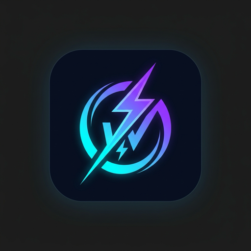

# Coach Watts Raycast Extension

<p align="center">
  
</p>

<p align="center">
  <b>Seamless macOS productivity integration for <a href="https://coachwatts.com">Coach Watts</a>.</b><br/>
  View daily training recommendations, search completed workouts, monitor recovery biometrics, ask the AI Coach, and trigger background data sync — directly from Raycast.
</p>

<p align="center">
  <a href="#-features">Features</a> •
  <a href="#-configuration">Configuration</a> •
  <a href="#-commands">Commands</a> •
  <a href="#-development">Development</a> •
  <a href="#-license">License</a>
</p>

---

## ✨ Features

- 🚴 **Today's Training**: Access daily AI activity recommendations, target intensity, duration, and actionable advice instantly.
- 📊 **Recent Workouts**: Search and inspect completed activities with key performance metrics (Power, Normalized Power, HR, TSS, Distance, Pace, Elevation).
- 💚 **Wellness & Biometrics**: Track recovery scores, HRV (rMSSD), resting heart rate, sleep metrics, weight, and fitness load trends (CTL / ATL / TSB).
- 💬 **Ask AI Coach**: Submit prompts directly to Coach Watts AI and receive structured coaching advice in markdown.
- 🔄 **Trigger Data Sync**: One-click HUD action to run background data ingestion & synchronization across connected services.
- 🔐 **OAuth 2.0 & API Key Auth**: Authenticate via seamless OAuth 2.0 PKCE with `https://coachwatts.com` or use an optional API key.
- 🌐 **Self-Hosted Support**: Fully configurable server URL to connect with self-hosted Coach Watts instances.

---

## ⚡ Commands

| Command | Icon | Mode | Description |
| :--- | :---: | :---: | :--- |
| **Today's Training** | 🚴 | Detail | View today's AI workout recommendation, target duration, TSS, and advice. |
| **Recent Workouts** | 📊 | List | Search and inspect past workouts with full performance breakdown. |
| **Wellness & Biometrics** | 💚 | List / Detail | Monitor daily recovery logs, HRV, RHR, sleep hours, and CTL/ATL/TSB load. |
| **Ask AI Coach** | 💬 | Form / Detail | Ask Coach Watts AI questions regarding training, pacing, or recovery. |
| **Trigger Data Sync** | 🔄 | HUD | Trigger background data synchronization from third-party services. |

---

## ⚙️ Configuration & Setup

### 1. Default (Coach Watts Cloud)
By default, the extension connects to `https://coachwatts.com`. When running a command for the first time, Raycast will automatically prompt you to authorize your account via **OAuth 2.0 with PKCE**.

### 2. Extension Preferences
Open Raycast Preferences (`Cmd + ,` while highlighting any Coach Watts command) to customize settings:

- **Server Base URL** (Default: `https://coachwatts.com`):
  - For cloud: `https://coachwatts.com`
  - For local development: `http://localhost:3000`
  - For self-hosted instance: `https://your-custom-domain.com`

- **API Key (Optional)**:
  - If specified, the extension uses the API Key via `X-API-Key` and `Authorization: Bearer <API_KEY>` headers instead of OAuth.

---

## 💻 Local Development

### Prerequisites
- macOS
- Node.js (v18+)
- [Raycast](https://raycast.com) app installed

### Setup & Running

```bash
# Clone repository
git clone https://github.com/hdkiller/coach-watts-raycast.git
cd coach-watts-raycast

# Install dependencies
npm install

# Start extension in development mode (Raycast must be running)
npm run dev

# Run TypeScript type check
npm run typecheck

# Build production extension bundle
npm run build
```

---

## 📦 Project Structure

```
coach-watts-raycast/
├── assets/
│   └── command-icon.png     # Extension icon
├── src/
│   ├── api/
│   │   ├── client.ts         # Coach Watts REST API wrapper
│   │   └── oauth.ts          # OAuth 2.0 PKCE & preference helper
│   ├── today.tsx            # Today's Training recommendation view
│   ├── workouts.tsx         # Recent Workouts list view
│   ├── wellness.tsx         # Wellness & Biometrics list view
│   ├── ask-coach.tsx        # Ask AI Coach form view
│   └── sync.tsx             # Trigger Data Sync HUD command
├── package.json             # Raycast Extension manifest
├── tsconfig.json            # TypeScript configuration
└── README.md                # Documentation
```

---

## 📄 License

MIT © [Laszlo Racz (hdkiller)](https://github.com/hdkiller)
